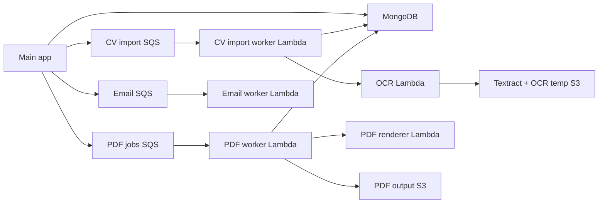

# AWS Services Configuration

This guide documents the AWS services used by NexCV and the permissions needed for production. It covers S3, Lambda, SQS queues, queue workers, and the main app IAM user.

## Current AWS Shape

NexCV uses AWS in five areas:

- S3 for admin-managed template files.
- OCR Lambda for CV import text extraction with Textract and temporary S3 storage.
- CV import SQS queue plus worker Lambda for background CV import parsing.
- PDF renderer Lambda plus PDF export SQS queue and worker Lambda for background PDF downloads.
- Optional email SQS queue plus worker Lambda for async transactional email.

The main app sends jobs to queues. Queue worker Lambdas do the expensive work and write results back to MongoDB or S3. This keeps the Node app host from spending memory and CPU on OCR, Chromium, and slow email providers.



## Region Plan

Use explicit per-service region variables instead of relying only on `AWS_REGION`.

Recommended for the current setup:

```env
AWS_REGION=eu-north-1
CV_IMPORT_QUEUE_REGION=eu-central-1
PDF_QUEUE_REGION=eu-north-1
EMAIL_QUEUE_REGION=eu-north-1
OCR_LAMBDA_REGION=eu-central-1
```

The CV import queue and CV import worker should live in `eu-central-1` because the existing OCR Lambda is `OCR_data_Extract` in `eu-central-1`.

## Main App Environment

Set these on Render, Lightsail, EC2, or the main Node host.

```env
AWS_REGION=eu-north-1
AWS_ACCESS_KEY_ID=main_app_iam_user_key
AWS_SECRET_ACCESS_KEY=main_app_iam_user_secret

S3_TEMPLATE_BUCKET_NAME=your_template_bucket
S3_TEMPLATE_PREFIX=templates

PDF_QUEUE_URL=https://sqs.eu-north-1.amazonaws.com/040769423342/nexcv-pdf-jobs-prod1
PDF_QUEUE_REGION=eu-north-1
PDF_OUTPUT_BUCKET_NAME=nexcv-pdf-jobs-prod1
PDF_OUTPUT_PREFIX=pdf-jobs

CV_IMPORT_QUEUE_URL=https://sqs.eu-central-1.amazonaws.com/040769423342/nexcv-cv-import-jobs-prod1
CV_IMPORT_QUEUE_REGION=eu-central-1
CV_IMPORT_LOCAL_WORKER_DISABLED=true

EMAIL_QUEUE_URL=https://sqs.eu-north-1.amazonaws.com/040769423342/nexcv-email-jobs-prod1
EMAIL_QUEUE_REGION=eu-north-1

OCR_LAMBDA_FUNCTION_NAME=OCR_data_Extract
OCR_LAMBDA_REGION=eu-central-1
OCR_LAMBDA_TIMEOUT_MS=45000

PDF_LAMBDA_URL=https://your-pdf-renderer-lambda-url
PDF_LAMBDA_TIMEOUT_MS=45000
```

`CV_IMPORT_LOCAL_WORKER_DISABLED=true` is important in production. It prevents the main app from running OCR/import parsing locally when the SQS queue is configured.

## Main App IAM User Policy

Attach this to the IAM user whose access keys are used by the main app, for example `NexCV-S3-user`. Adjust bucket names if your production names differ.

```json
{
  "Version": "2012-10-17",
  "Statement": [
    {
      "Sid": "ManageTemplateObjects",
      "Effect": "Allow",
      "Action": [
        "s3:GetObject",
        "s3:PutObject",
        "s3:DeleteObject"
      ],
      "Resource": "arn:aws:s3:::YOUR_TEMPLATE_BUCKET/templates/*"
    },
    {
      "Sid": "SendPdfJobs",
      "Effect": "Allow",
      "Action": [
        "sqs:SendMessage",
        "sqs:GetQueueAttributes"
      ],
      "Resource": "arn:aws:sqs:eu-north-1:040769423342:nexcv-pdf-jobs-prod1"
    },
    {
      "Sid": "SendCvImportJobs",
      "Effect": "Allow",
      "Action": [
        "sqs:SendMessage",
        "sqs:GetQueueAttributes"
      ],
      "Resource": "arn:aws:sqs:eu-central-1:040769423342:nexcv-cv-import-jobs-prod1"
    },
    {
      "Sid": "ReadCvImportDlqAttributes",
      "Effect": "Allow",
      "Action": [
        "sqs:GetQueueAttributes"
      ],
      "Resource": "arn:aws:sqs:eu-central-1:040769423342:nexcv-cv-import-jobs-prod1-dlq"
    },
    {
      "Sid": "SendEmailJobs",
      "Effect": "Allow",
      "Action": [
        "sqs:SendMessage",
        "sqs:GetQueueAttributes"
      ],
      "Resource": "arn:aws:sqs:eu-north-1:040769423342:nexcv-email-jobs-prod1"
    }
  ]
}
```

If the main app streams generated PDFs from S3, also grant read access to the PDF output prefix:

```json
{
  "Sid": "ReadPdfJobObjects",
  "Effect": "Allow",
  "Action": [
    "s3:GetObject"
  ],
  "Resource": "arn:aws:s3:::nexcv-pdf-jobs-prod1/pdf-jobs/*"
}
```

## SQS Defaults

Use these defaults for each worker queue unless a section below says otherwise.

```txt
Type: Standard
Visibility timeout: Lambda timeout + 60 seconds
Message retention: 4 days
Receive message wait time: 20 seconds
Delivery delay: 0 seconds
Encryption: SQS managed SSE
DLQ: enabled
DLQ max receives: 3
```

Create a separate DLQ for each queue. Do not attach a Lambda trigger to the DLQ.

DLQ settings:

```txt
Type: Standard
Visibility timeout: 30 seconds
Message retention: 14 days
Receive message wait time: 0 or 20 seconds
Encryption: SQS managed SSE
```

## CV Import Queue

Purpose: move CV import parsing out of the main app. The worker reads a `CvImportJob`, calls the OCR Lambda when configured, runs AI parsing for paid users, stores the result in MongoDB, and removes uploaded base64 data from the job document.

Queue:

```txt
Region: eu-central-1
Queue name: nexcv-cv-import-jobs-prod1
DLQ name: nexcv-cv-import-jobs-prod1-dlq
Visibility timeout: 180 seconds
```

Main app env:

```env
CV_IMPORT_QUEUE_URL=https://sqs.eu-central-1.amazonaws.com/040769423342/nexcv-cv-import-jobs-prod1
CV_IMPORT_QUEUE_REGION=eu-central-1
CV_IMPORT_LOCAL_WORKER_DISABLED=true
```

Build worker ZIP:

```bash
corepack pnpm build:cv-import-worker-lambda
```

Deploy:

```txt
Function name: nexcv-cv-import-worker-prod1
Runtime: Node.js 20.x
Handler: handler.handler
Architecture: x86_64
Memory: 1024 MB minimum
Timeout: 120 seconds
ZIP: lambda-cv-import-worker/dist/nexcv-cv-import-worker.zip
```

Worker env:

```env
AWS_REGION=eu-central-1
MONGODB_URI=your_mongodb_uri
GEMINI_API_KEY=your_gemini_key
OCR_LAMBDA_FUNCTION_NAME=OCR_data_Extract
OCR_LAMBDA_REGION=eu-central-1
OCR_LAMBDA_TIMEOUT_MS=45000
```

SQS trigger:

```txt
Source: SQS
Queue: nexcv-cv-import-jobs-prod1
Activate trigger: Yes
Batch size: 1
Batch window: 0 seconds
Maximum concurrency: 5
Report batch item failures: Yes
On-failure destination: None
```

Worker role policy:

```json
{
  "Version": "2012-10-17",
  "Statement": [
    {
      "Sid": "ConsumeCvImportQueue",
      "Effect": "Allow",
      "Action": [
        "sqs:ReceiveMessage",
        "sqs:DeleteMessage",
        "sqs:GetQueueAttributes",
        "sqs:ChangeMessageVisibility"
      ],
      "Resource": "arn:aws:sqs:eu-central-1:040769423342:nexcv-cv-import-jobs-prod1"
    },
    {
      "Sid": "InvokeOcrDataExtract",
      "Effect": "Allow",
      "Action": [
        "lambda:InvokeFunction"
      ],
      "Resource": "arn:aws:lambda:eu-central-1:040769423342:function:OCR_data_Extract"
    }
  ]
}
```

Also attach AWS managed policy `AWSLambdaBasicExecutionRole` for CloudWatch logs.

## OCR Lambda And Textract

Purpose: extract text from imported PDFs/images. This Lambda can use Textract and a private temporary S3 bucket.

Build:

```bash
corepack pnpm build:ocr-lambda
```

Deploy:

```txt
Function name: OCR_data_Extract
Region: eu-central-1
Runtime: Node.js 20.x
Handler: handler.handler
Memory: 512 MB minimum
Timeout: 60 seconds or higher
ZIP: lambda-ocr/dist/nexcv-ocr-lambda.zip
```

Env:

```env
AWS_REGION=eu-central-1
OCR_DOCUMENT_BUCKET=your-temp-ocr-bucket
OCR_DOCUMENT_PREFIX=ocr-imports
OCR_TEXTRACT_TIMEOUT_MS=55000
OCR_TEXTRACT_MAX_PAGES=8
GEMINI_API_KEY=optional_if_structured_parse_runs_in_ocr_lambda
```

OCR Lambda role policy:

```json
{
  "Version": "2012-10-17",
  "Statement": [
    {
      "Sid": "UseOcrTempBucket",
      "Effect": "Allow",
      "Action": [
        "s3:GetObject",
        "s3:PutObject",
        "s3:DeleteObject"
      ],
      "Resource": "arn:aws:s3:::YOUR_OCR_TEMP_BUCKET/ocr-imports/*"
    },
    {
      "Sid": "RunTextract",
      "Effect": "Allow",
      "Action": [
        "textract:StartDocumentTextDetection",
        "textract:GetDocumentTextDetection",
        "textract:DetectDocumentText"
      ],
      "Resource": "*"
    }
  ]
}
```

Keep the OCR temp bucket private, block public access, enable encryption, and add a lifecycle rule to delete `ocr-imports/` objects after 1 day.

## PDF Export Queue

Purpose: move PDF rendering and S3 upload out of the main app. The main app creates a `PdfJob`, sends the job ID to SQS, and the frontend polls until the PDF is ready.

Queue:

```txt
Region: eu-north-1
Queue name: nexcv-pdf-jobs-prod1
DLQ name: nexcv-pdf-jobs-prod1-dlq
Visibility timeout: 120-180 seconds
```

Main app env:

```env
PDF_QUEUE_URL=https://sqs.eu-north-1.amazonaws.com/040769423342/nexcv-pdf-jobs-prod1
PDF_QUEUE_REGION=eu-north-1
PDF_OUTPUT_BUCKET_NAME=nexcv-pdf-jobs-prod1
PDF_OUTPUT_PREFIX=pdf-jobs
```

Build worker ZIP:

```bash
corepack pnpm build:pdf-worker-lambda
```

Deploy:

```txt
Function name: nexcv-pdf-worker-prod1
Runtime: Node.js 20.x
Handler: handler.handler
Memory: 512 MB minimum
Timeout: 90 seconds
ZIP: lambda-pdf-worker/dist/nexcv-pdf-worker.zip
```

Worker env:

```env
AWS_REGION=eu-north-1
MONGODB_URI=your_mongodb_uri
PDF_LAMBDA_URL=https://your-pdf-renderer-lambda-url
PDF_LAMBDA_TIMEOUT_MS=45000
PDF_OUTPUT_BUCKET_NAME=nexcv-pdf-jobs-prod1
PDF_OUTPUT_PREFIX=pdf-jobs
```

SQS trigger:

```txt
Source: SQS
Queue: nexcv-pdf-jobs-prod1
Batch size: 1
Batch window: 0 seconds
Maximum concurrency: 10
Report batch item failures: Yes
```

Worker role policy:

```json
{
  "Version": "2012-10-17",
  "Statement": [
    {
      "Sid": "ConsumePdfQueue",
      "Effect": "Allow",
      "Action": [
        "sqs:ReceiveMessage",
        "sqs:DeleteMessage",
        "sqs:GetQueueAttributes",
        "sqs:ChangeMessageVisibility"
      ],
      "Resource": "arn:aws:sqs:eu-north-1:040769423342:nexcv-pdf-jobs-prod1"
    },
    {
      "Sid": "WritePdfJobObjects",
      "Effect": "Allow",
      "Action": [
        "s3:PutObject",
        "s3:GetObject"
      ],
      "Resource": "arn:aws:s3:::nexcv-pdf-jobs-prod1/pdf-jobs/*"
    }
  ]
}
```

Add a lifecycle rule on the PDF output bucket to expire `pdf-jobs/` objects after 1-7 days.

## PDF Renderer Lambda

Purpose: render HTML/CV data to PDF using Chromium.

Build:

```bash
corepack pnpm build:pdf-lambda
```

Deploy:

```txt
Function name: nexcv-pdf-renderer-prod1
Runtime: Node.js 20.x
Handler: handler.handler
Architecture: x86_64
Memory: 1024 MB minimum, 2048 MB recommended for heavier templates
Timeout: 60 seconds
ZIP: lambda-pdf/dist/nexcv-pdf-lambda.zip
Function URL or API Gateway: enabled for worker/app access
```

Env:

```env
AWS_REGION=eu-north-1
S3_TEMPLATE_BUCKET_NAME=your_template_bucket
S3_TEMPLATE_PREFIX=templates
S3_TEMPLATE_CACHE_TTL_MS=300000
```

Role policy for template reads:

```json
{
  "Version": "2012-10-17",
  "Statement": [
    {
      "Sid": "ReadTemplateObjects",
      "Effect": "Allow",
      "Action": [
        "s3:GetObject"
      ],
      "Resource": "arn:aws:s3:::YOUR_TEMPLATE_BUCKET/templates/*"
    }
  ]
}
```

## Email Queue

Purpose: send transactional emails asynchronously.

Queue:

```txt
Region: eu-north-1
Queue name: nexcv-email-jobs-prod1
DLQ name: nexcv-email-jobs-prod1-dlq
Visibility timeout: 60 seconds
```

Main app env:

```env
EMAIL_QUEUE_URL=https://sqs.eu-north-1.amazonaws.com/040769423342/nexcv-email-jobs-prod1
EMAIL_QUEUE_REGION=eu-north-1
```

Build:

```bash
corepack pnpm build:email-worker-lambda
```

Deploy:

```txt
Function name: nexcv-email-worker-prod1
Runtime: Node.js 20.x
Handler: handler.handler
Memory: 256 MB
Timeout: 30 seconds
ZIP: lambda-email-worker/dist/nexcv-email-worker.zip
```

Worker env:

```env
AWS_REGION=eu-north-1
EMAIL_FROM="NexCV <support@example.com>"
RESEND_API_KEY=your_resend_key
# or SMTP fallback:
EMAIL_USER=your_smtp_user
EMAIL_PASS=your_smtp_password
SMTP_HOST=smtp.gmail.com
SMTP_PORT=587
```

Worker role policy:

```json
{
  "Version": "2012-10-17",
  "Statement": [
    {
      "Sid": "ConsumeEmailQueue",
      "Effect": "Allow",
      "Action": [
        "sqs:ReceiveMessage",
        "sqs:DeleteMessage",
        "sqs:GetQueueAttributes",
        "sqs:ChangeMessageVisibility"
      ],
      "Resource": "arn:aws:sqs:eu-north-1:040769423342:nexcv-email-jobs-prod1"
    }
  ]
}
```

## S3 Buckets

### Template Bucket

Use a private bucket for admin template assets.

```txt
Bucket: your_template_bucket
Prefix: templates/
Public access: blocked
Encryption: enabled
Versioning: optional but recommended
```

The main app writes admin-managed template HTML/CSS/thumbnail files. The PDF renderer Lambda reads template files when rendering custom templates.

### PDF Output Bucket

Use a private bucket for temporary PDF job outputs.

```txt
Bucket: nexcv-pdf-jobs-prod1
Prefix: pdf-jobs/
Public access: blocked
Encryption: enabled
Lifecycle: expire pdf-jobs/ after 1-7 days
```

### OCR Temp Bucket

Use a private bucket for temporary OCR documents.

```txt
Bucket: your-temp-ocr-bucket
Prefix: ocr-imports/
Public access: blocked
Encryption: enabled
Lifecycle: expire ocr-imports/ after 1 day
```

## Production Smoke Tests

### CV Import Queue

Send a dummy job ID to SQS:

```json
{ "jobId": "000000000000000000000004" }
```

Expected after 20-60 seconds:

```txt
Main queue visible: 0
Main queue not-visible: 0
DLQ visible: 0
```

Then test with a real upload from the app. In MongoDB `cvimportjobs`, the job should move:

```txt
queued -> processing -> ready
```

`base64Data` should be removed when the job completes or fails.

### PDF Queue

Click export PDF in the app. In MongoDB `pdfjobs`, the job should move:

```txt
queued -> processing -> ready
```

S3 should contain:

```txt
pdf-jobs/YYYY-MM-DD/<jobId>.pdf
```

### Email Queue

Trigger a verification, reset, support, or billing email. The email queue should drain to zero and no message should reach the DLQ.

## Troubleshooting

### SQS Message Stays Not Visible

The Lambda trigger picked up the message but the invocation has not finished. Check:

- Lambda handler is `handler.handler`, not `index.handler`.
- Lambda timeout and memory are high enough.
- CloudWatch logs for import, PDF, or email worker.
- MongoDB network access from Lambda.

### Message Returns To Visible Or Goes To DLQ

The Lambda is failing. Check:

- Required env vars are present.
- Worker role can consume SQS.
- Worker role can invoke downstream Lambda if needed.
- OCR/PDF downstream Lambda handler and permissions are correct.

### Function Cannot Find Handler

All worker ZIPs in this repo use:

```txt
handler.handler
```

Do not use `index.handler` unless the ZIP contains `index.js`.

### CV Import Hangs Or Fails

Check:

- `CV_IMPORT_LOCAL_WORKER_DISABLED=true` on production app.
- `OCR_LAMBDA_FUNCTION_NAME=OCR_data_Extract`.
- `OCR_LAMBDA_REGION=eu-central-1`.
- Worker role has `lambda:InvokeFunction` for `OCR_data_Extract`.
- OCR Lambda role has Textract and OCR temp S3 permissions.

### Render Has A Different AWS_REGION

Do not change global `AWS_REGION` if other features depend on it. Use feature-specific region variables:

```env
CV_IMPORT_QUEUE_REGION=eu-central-1
OCR_LAMBDA_REGION=eu-central-1
PDF_QUEUE_REGION=eu-north-1
EMAIL_QUEUE_REGION=eu-north-1
```
